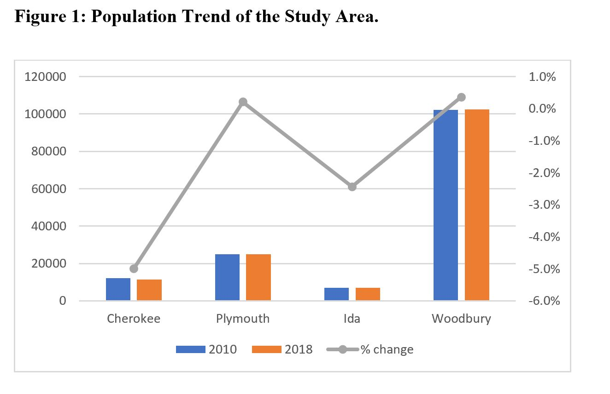
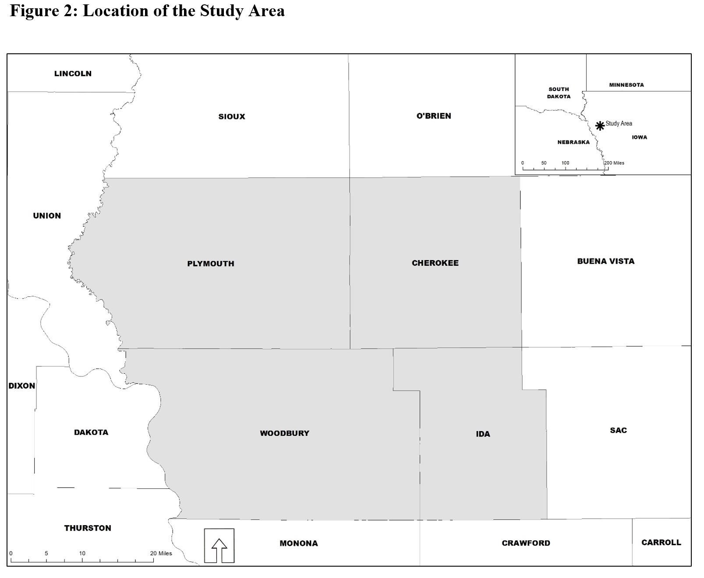

## Suitability Analysis, Using Arcpy Python Library
The study area for this project is the four counties (Cherokee, Plymouth, Ida, and Woodbury County) within the Iowa portion of Siouxland Interstate Metropolitan Planning Council. From Figure 2 the study area is located in the northwestern portion of the State of Iowa. Some of the counties bordering the study area include Union County, SD; Dakota County, NE; Monona, IA; Crawford, IA, Sac County, IA, among others. According to the 2010 decennial census, the total population of the study area was 146,319 in 2010, with 8.5% living in Cherokee County, 4.8% living in Ida County, 17.1% living in Plymouth County, and the remaining 69.8% living in Woodbury County. The estimates from the 2018 American Community Survey show that the population of the study area decreased to 145,962 in 2018, representing a decline of 0.24%. The counties within the study area that experienced a major decline in population between 2010 and 2018 were Cherokee County and Ida County. This trend is partly due to the rural nature of these counties. While Woodbury County and Plymouth County on the other hand experienced population growth from 2010 to 2018 by 0.4% and 0.2% respectively (see Figure 1 below).





## Project Description
The study area, especially Woodbury County, has recently experienced unprecedented industrial growth when compared to other counties within the Tri-State Region (Nebraska, S. Dakota, and Iowa). In light of this, I wanted to assess the most suitable areas within the study area for the establishment of a new industry.  The objective of this research is to identify the most suitable sites within the study area for the establishment of a processing plant. For the region to continue to attract industries, the Economic Development Department of each of the counties must identify potential areas they can develop into shovel ready sites. 

## Methodology
The method deployed in executing this project is quantitative. The python programming language was used in executing this project (check appendix for the code). The arcpy module from ESRI, which is installed along ArcGIS Desktop Software was used for the analysis. The table below shows the type and sources of data used in the study. The data used for this study included parcel, floodplain, wetland, major road, and population density. Four of the data set were nominal data while only one data set was ordinal. All the data set were in vector format.  The majority of the data came from local, state, and federal governments. 

GIS dataset     |   Description     |     Sources     |      Date    |    Data Type  |
-------------   |   ------------    |    ---------    |     ------   |   ----------  |
Parcel data     | Parcel data shows the quantity of land identified for taxation purposes. It contains land use necessary for the suitability analysis. | Woodbury County Assessor, Cherokee County Assessor, Ida County Assessor, Plymouth County Assessor | 2019 | Vector |   


### Markdown

Markdown is a lightweight and easy-to-use syntax for styling your writing. It includes conventions for

```markdown
Syntax highlighted code block

# Suitability Analysis for Location of Processing Plant


## Header 2
### Header 3

- Bulleted
- List

1. Numbered
2. List

**Bold** and _Italic_ and `Code` text

[Link](url) and 
```

For more details see [GitHub Flavored Markdown](https://guides.github.com/features/mastering-markdown/).

### Jekyll Themes

Your Pages site will use the layout and styles from the Jekyll theme you have selected in your [repository settings](https://github.com/Gabriel-Appiah/GIS_python/settings/pages). The name of this theme is saved in the Jekyll `_config.yml` configuration file.

### Support or Contact

Having trouble with Pages? Check out our [documentation](https://docs.github.com/categories/github-pages-basics/) or [contact support](https://support.github.com/contact) and we’ll help you sort it out.
