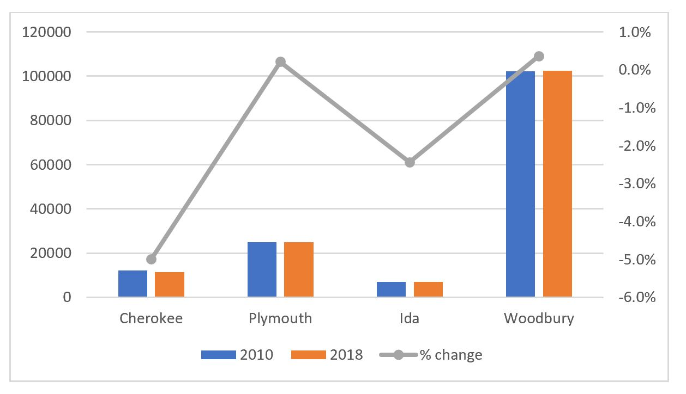
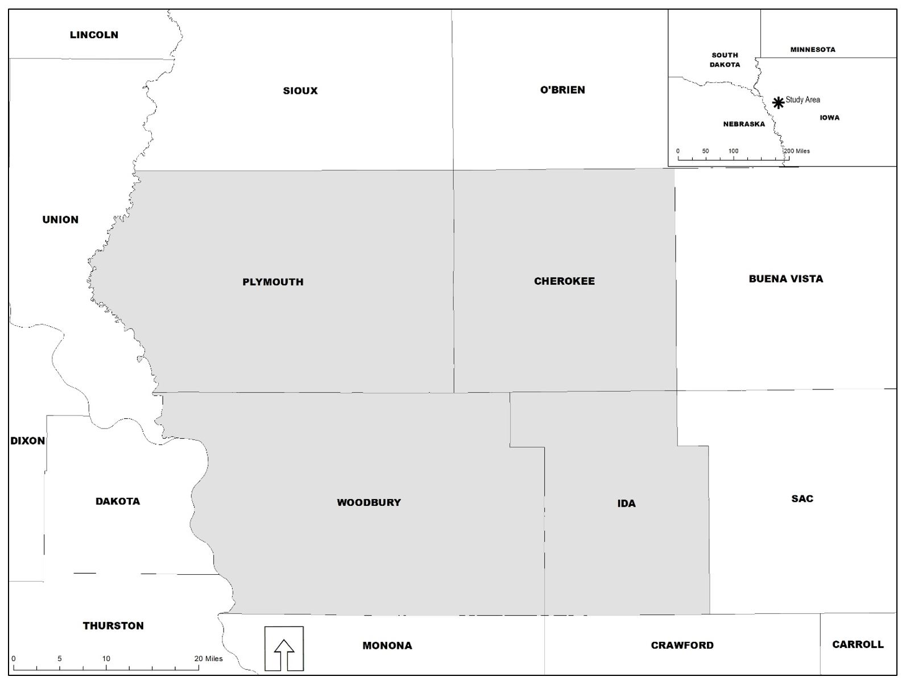
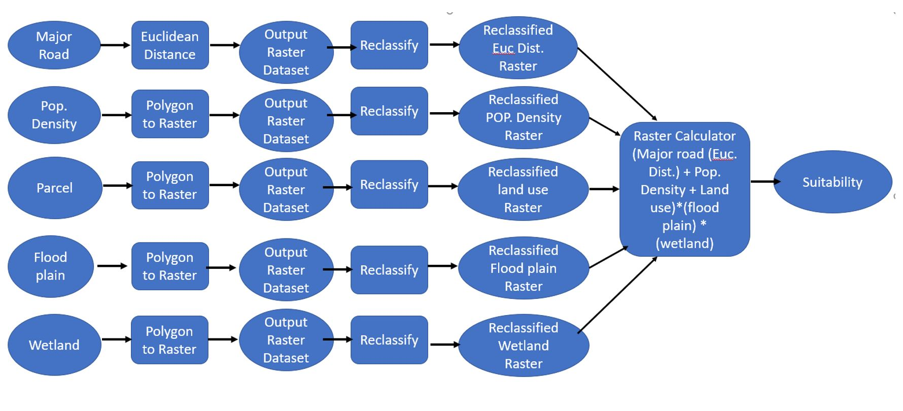

## Suitability Analysis, Using Arcpy Python Library
The study area for this project is the four counties (Cherokee, Plymouth, Ida, and Woodbury County) within the Iowa portion of Siouxland Interstate Metropolitan Planning Council. From Figure 2 the study area is located in the northwestern portion of the State of Iowa. Some of the counties bordering the study area include Union County, SD; Dakota County, NE; Monona, IA; Crawford, IA, Sac County, IA, among others. According to the 2010 decennial census, the total population of the study area was 146,319 in 2010, with 8.5% living in Cherokee County, 4.8% living in Ida County, 17.1% living in Plymouth County, and the remaining 69.8% living in Woodbury County. The estimates from the 2018 American Community Survey show that the population of the study area decreased to 145,962 in 2018, representing a decline of 0.24%. The counties within the study area that experienced a major decline in population between 2010 and 2018 were Cherokee County and Ida County. This trend is partly due to the rural nature of these counties. While Woodbury County and Plymouth County on the other hand experienced population growth from 2010 to 2018 by 0.4% and 0.2% respectively (see Figure 1 below).

**Figure 1: Population Trend of the Study Area.**


**Figure 2: Location of the Study Area**


## Project Description
The study area, especially Woodbury County, has recently experienced unprecedented industrial growth when compared to other counties within the Tri-State Region (Nebraska, S. Dakota, and Iowa). In light of this, I wanted to assess the most suitable areas within the study area for the establishment of a new industry.  The objective of this research is to identify the most suitable sites within the study area for the establishment of a processing plant. For the region to continue to attract industries, the Economic Development Department of each of the counties must identify potential areas they can develop into shovel ready sites. 

## Methodology
The method deployed in executing this project is quantitative. The python programming language was used in executing this project (check appendix for the code). The arcpy module from ESRI, which is installed along ArcGIS Desktop Software was used for the analysis. The table below shows the type and sources of data used in the study. The data used for this study included parcel, floodplain, wetland, major road, and population density. Four of the data set were nominal data while only one data set was ordinal. All the data set were in vector format.  The majority of the data came from local, state, and federal governments. 

GIS dataset     |   Description     |     Sources     |      Date    |    Data Type  |
-------------   |   ------------    |    ---------    |     ------   |   ----------  |
Parcel data     | Parcel data shows the quantity of land identified for taxation purposes. It contains land use necessary for the suitability analysis. | Woodbury County Assessor, Cherokee County Assessor, Ida County Assessor, Plymouth County Assessor | 2019 | Vector |  
 Floodplain data | This dataset incorporates all Flood Insurance Rate Map (FIRM) databases published by FEMA. This dataset contains information on flood hazards.| [FEMA](https://msc.fema.gov/portal/home) [National Flood Hazard Data set](https://hazards.fema.gov/femaportal/wps/portal/NFHLWMSkmzdownload)| 2011 | Vector |
 Wetland data  | This dataset contains an inventory of wetlands in the country and provides detailed information on the abundance, characteristics, and distribution of wetlands in the nation. | [US Fish and Wildlife Service: National Wetlands Inventory:](https://www.fws.gov/wetlands/data/data-download.html) | 2018 | Vector |
 Major Road Dataset | This dataset contained major roads (Interstate, Other principal arterials, minor arterial, and Major collector) within Cherokee, Plymouth, Ida, and Woodbury County.| [Iowa Dot](https://data.iowadot.gov/) | 2019 | Vector |
 Population density by block group | This dataset contains the population by block group. The population density was obtained by dividing the pop. by the area of the block group. |  [U.S. Census Bureau](https://www.census.gov/acs/www/data/data-tables-and-tools/american-factfinder/) | 2015 | Vector |


Figure 3 below shows that the model used in analyzing the data set is the ordinal combination and pass/fail model. The data set was first prepared by using arcpy functions such as merge. Using the select by attribute function major roads (interstate, minor arterial, other principal arterials, and major collectors) were selected. The selected roads were converted into Euclidean Distance using spatial analytic function – Euclidean Distance. This was necessary to be able to estimate the distance from each of the major roads in the study area. The resulted raster was reclassified as shown in Table 2 below, using the reclassify function. A for loop was then used to loop through the parcel, floodplain, population density, and wetland dataset, and converted from vector to raster. The resulted raster was then reclassified as shown in Table 2 below, using the reclassify function (see Figure 4 below for a map of reclassified rasters). Note that Plymouth County’s floodplain dataset is not available, so I assumed that the entire county was outside the 100-year flood zone. The reclassified rasters were then combined using the raster calculator function and the equation below: 

$$Suitability = \(Dist. from major road + Pop. Density + land use) \times flood plain \times  wetland$$

The suitable areas for establishing a processing plant were then calculated as outlined in the code in the appendix.

**Figure 3: Project workflow diagram**



|Factors|Data Ranges | Ratings |
|:-------|:-------|:---------|
|Type of land use (parcel) |Exempt land use (schools, parks, etc.)<br/>Residential<br/>Commercial<br/>Industry<br/>Agriculture |0<br/>0<br/>3<br/>4<br/>4|
|Floodplain (Flood Zones & areas outside flood zones)|100 years flood zone <br/> Zone outside 100 years flood zone |0 <br/> 1|
|Wetland data (Wetlands & areas outside wetlands) | Wetland Zone <br/> Areas outside wetland zone | 0 <br/>1|
|Distance from a major road (Interstate, Other principal arterials, minor arterial and major collector) in meters|6000+  <br/> 4501 - 6000 <br/> 3001 - 4500 <br/> 1501 - 3000 <br/> 0 - 1500|0 <br/> 1 <br/> 2 <br/> 3 <br/> 4|
|Population density (pop/sqkm)| 0 - 100 <br/> 101 - 500 <br/> 501 -2500 <br/> 2501 - 5000 <br/> 5000+ |0 <br/> 1 <br/> 2 <br/> 3 <br/>4|

**Figure 4: Map of Reclassified Raster**

[updatedfloodplainmxd](updatedfloodplainmxd.jpg)

[LandUse](LandUSe.jpg)

[EuclideanDistance](EuclideanDistance.jpg)

[Pop_Density_new](Pop_Density_new.jpg)

[Wetland](Wetland.jpg)


## Results 
Figure 5 below show the results of the analysis. The study area is approximately 6880.07 km2 in size, out of which 696.75 km2 is not suitable for the establishment of a processing plant, this represents 10.1% of the study area. Approximately 280.79 km2 of the study area is least suitable for the establishment of a processing plant, representing 4.1% of the study area, whereas 5798.43 km2 of the study area is moderately suitable for the establishment of a processing plant - representing 84.3% of the study area. This trend is because the majority of the population is concentrated in the major cities. The results of the analysis also show that only 104.10 km2 of the study area is most suitable for the establishment of a processing plant, this represents 1.5% of the study area.
Also, comparing the major cities within the study area, the most (22.9 km2)  and moderately suitable land (79.5 km2) for the establishment of a processing plant are located in Sioux City. This result is not surprising as it is the largest city within the study area. The City of Le Mars is the second city to have the most (9.4km2) and moderately (10.8km2) suitable land for the establishment of a processing plant. Whereas, the City of Ida Grove has only 1.1 km2 of land which is moderately suitable for the establishment of a processing plant. None of the land areas in the City of Ida Grove was most suitable for the establishment of a processing plant. The City of Cherokee is the third city to have the most( 6.4 km2) and moderately (5.0 km2) suitable land for the establishment of a processing plant. 


**Figure 5: Suitability Map**

[Suitabilitymap](Suitabilitymap.JPG)

```markdown
#-------------------------------------------------------------------------------
# Name:        module1
# Purpose:
#
# Author:      Gabriel
#
# Created:     24/11/2020
#-------------------------------------------------------------------------------

import arcpy, os, sys

from arcpy.sa import *

# set your workspace, processing extent and raster anlysis cell size
arcpy.env.workspace = r'C:\Users\Gabriel\Desktop\Newaywsofdoingthings - Copy'

arcpy.env.cellSize = 100

# Data Preparation
# check out spatial analytic extension
arcpy.CheckOutExtension("spatial")

# Dissolve Counties Boundaries and use it as the env. extent

arcpy.Dissolve_management("StudyArea.shp","Dissolve_Co.shp","","","MULTI_PART","DISSOLVE_LINES")

arcpy.env.extent = "Dissolve_Co.shp"

# Convert counties polygon to raster to be used as a mask

#arcpy.PolygonToRaster_conversion("Dissolve_Co.shp", "FID", "raster_county","CELL_CENTER")

arcpy.env.mask = "rast_county"


#Data Preparation for Analysis
# Clipping files
#def clipt(inputfeature, clip_features,outfeature):
    #clipAnlysis = arcpy.Clip_analysis(inputfeature,clip_features,outfeature)
    #return clipAnlysis

#clipt("POP.shp","Dissolve_Co.shp","POPbyStudy.shp")
#clipt("Merge_Wetlands.shp","Dissolve_Co.shp","Wetlands.shp")
#clipt("Regional_Road.shp","Dissolve_Co.shp","Road1.shp")

# Replace a layer/table view name with a path to a dataset (which can be a layer file) or create the layer/table view within the script
# The following inputs are layers or table views: "PoPproj", "Dissolve_Co"


#Projecting the population by Block Group Data using State Plane
#Delete old files not useful in the analysis

#outCS = arcpy.SpatialReference('NAD 1983 UTM Zone 14N')
#arcpy.Project_management("POP.shp","POPbyStudy.shp",outCS)

#in_features = "POPbyStudy.shp"
#clip_features = "Dissolve_Co.shp"
#out_feature_class= r'C:\Users\Gabriel\Desktop\FinalFinalnewFinalFinal - Copy\Popproj.shp'
#arcpy.Clip_analysis(in_features,clip_features,out_feature_class)


#arcpy.Delete_management("POPbyStudy.shp")
#arcpy.Delete_management("POP.shp")


#Merge parcel data of the 5 counties, and create fieldmapping object
parcel_Ply = "Plymouth_parcel.shp"
parcel_Ida = "IdaCounty.shp"
parcel_Che = "Cherokee.shp"
parcel_Woo = "WoodburyCounty.shp"
#parcel_Dak = "Dakota_parcel.shp"

out_feature5 = "Parcel.shp"

#Create the required Field Map and Field Mapping Objects

fm_Land_Class = arcpy.FieldMap()

fms = arcpy.FieldMappings()

#Get the field names of the outpute featues from the originals files
#add fields to their corresponding fieldmap objects

field = "Land_Class"

fm_Land_Class.addInputField(parcel_Ply,field)
fm_Land_Class.addInputField(parcel_Ida,field)
fm_Land_Class.addInputField(parcel_Che,field)
fm_Land_Class.addInputField(parcel_Woo,field)
#fm_Land_Class.addInputField(parcel_Dak,field)

#Set the output field properties for the fieldmap objects
#add the fieldMap objects to the FieldMapping object

fieldName = fm_Land_Class.outputField
fieldName.name = "Land_Class"
fm_Land_Class.outputField = fieldName

fms.addFieldMap(fm_Land_Class)


arcpy.Merge_management([parcel_Ply,parcel_Che,parcel_Ida,parcel_Woo], out_feature5, fms)


#Delete old files not useful in the analysis

def deletfc(FClass1,FClass2,FClass3,FClass4):
    shapefile0=arcpy.Delete_management(FClass1)
    shapefile1=arcpy.Delete_management(FClass2)
    shapefile2=arcpy.Delete_management(FClass3)
    shapefile3=arcpy.Delete_management(FClass4)
    #shapefile4=arcpy.Delete_management(FClass5)
    return shapefile0,shapefile1,shapefile2,shapefile3

deletfc(parcel_Ply,parcel_Ida,parcel_Che,parcel_Woo)


#in_features= "Regional_Road.shp"
#clip_features = "Dissolve_Co.shp"
#out_feature_class= r'C:\Users\Gabriel\Desktop\FinalFinalnewFinalFinal - Copy\Road.shp'
#arcpy.Clip_analysis(in_features,clip_features,out_feature_class)
#arcpy.Delete_management("Regional_Road.shp")

# select major roads using where clause in the five counties


arcpy.MakeFeatureLayer_management("Regional_Road.shp", "roadslyr")

wclause = """ "FFC" = 'Interstate' OR "FFC" = 'Minor Arterial' OR "FFC" = 'Other Principal Arterial' OR "FFC" = 'Major Collector' """

arcpy.SelectLayerByAttribute_management("roadslyr", "NEW_SELECTION", wclause)

# Calcuate the Eucleadean distance around the major roads in the five counties

arcpy.gp.EucDistance_sa("roadslyr", "EucDist", "", "", "", "PLANAR", "", "")


# create a function for polygon to raster convention

# convert polygon raster

#arcpy.PolygonToRaster_conversion("PoPproj.shp", "POP_DEN", "POPRaster","CELL_CENTER")

#arcpy.PolygonToRaster_conversion("Parcel.shp", "Land_Class", "LandRaster","CELL_CENTER")

#arcpy.PolygonToRaster_conversion("Wetland.shp", "WETLAND_TY", "WetRaster","CELL_CENTER")


#in_features = "Merge_Wetlands.shp"
#clip_features = "Dissolve_Co.shp"
#out_feature_class= r'C:\Users\Gabriel\Desktop\FinalFinalnewFinalFinal - Copy\Wetlands.shp'
#arcpy.Clip_analysis(in_features,clip_features,out_feature_class)
#arcpy.Delete_management("Merge_Wetlands.shp")


def rast_conv(inFeatures,valField,outRaster):
    rastLayer = arcpy.PolygonToRaster_conversion(inFeatures, valField, outRaster,"CELL_CENTER")
    return rastLayer

ft_Classes = arcpy.ListFeatureClasses()
for fc in ft_Classes:
    inFeatures = fc
    valField = [f.name for f in arcpy.ListFields(fc)]
    for f in valField:
        if f == "POP_DEN":
            valFields = f
            outRaster1 = "Rt" + f
            rast_conv(inFeatures,valFields,outRaster1)
        elif f == "Land_Class":
            valField1 = f
            outRaster2 = "Rt" + f
            rast_conv(inFeatures,valField1,outRaster2)
        elif f == "WETLAND_TY":
            valField2 = f
            outRaster3 = "Rst" + f
            rast_conv(inFeatures,valField2,outRaster3)
        elif f == "FLD_ZONE":
            valField3 = f
            outRaster4  = "Rst"+f
            rast_conv(inFeatures,valField3,outRaster4)
        else:
            print "Rest of the Feature Class would not be converted to raster dataset"


# Create a reclassification function the rasters
def reClass(rast,reclassField,remap,outfeature):
    reClassified = arcpy.gp.Reclassify_sa(rast, reclassField,remap,outfeature,"DATA")
    return reClassified

# Reclassify Wetland
rast0 = outRaster3
reclassField0 = "VALUE"
remap0 = "1 5 0;NODATA 1"
outfc0 = "reclasswetL"

reClass(rast0,reclassField0,remap0,outfc0)

#Reclassify Land Use
rast1 = outRaster2
reclassField1 = "LAND_CLASS"
remap1 = "Agricultural 4;Commercial 3;Residential 0;Exempt 0;Industrial 4"
outfc1 = "reclasspar"

reClass(rast1,reclassField1,remap1,outfc1)

# Reclassify Pop_Density
rast2 = outRaster1
reclassField2 = "VALUE"
remap2 = "0 100 0;100 500 1;500 2500 2;2500 5000 3;5000 13900 4"
outfc2 = "reclasspop"

reClass(rast2,reclassField2,remap2,outfc2)

# Reclassify Distance from Major Road
rast3 = "EucDist"
reclassField3 = "VALUE"
remap3 = "0 1500 4;1500 3000 3;3000 4500 2;4500 6000 1;6000 14000 0"
outfc3 = "reclassdist"

reClass(rast3,reclassField3,remap3,outfc3)

rast4 = outRaster4
reClassField4 = "FLD_ZONE"
remap4 = "'0.2 PCT ANNUAL CHANCE FLOOD HAZARD' 0;A 0;AE 0;X 1;AO 0;AH 0;NODATA 1"
outfc4 = "reClassFP"

reClass(rast4,reClassField4,remap4,outfc4)


# Combine the reclassified layers by using raster calculator
inputs = '("reclassdist"+"reclasspop"+"reclasspar")*"reclasswetl"*"reClassFP"'
outputfc = "suitablesite"

arcpy.gp.RasterCalculator_sa(inputs,outputfc)
print(arcpy.GetMessages())

```
